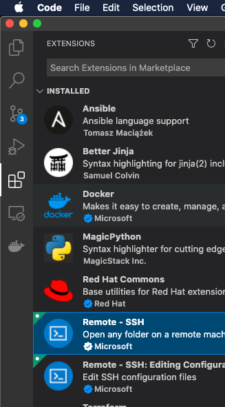
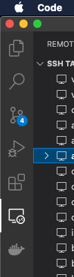
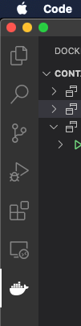
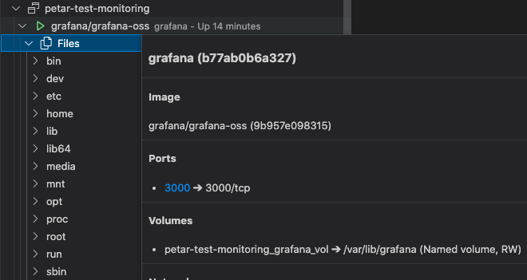
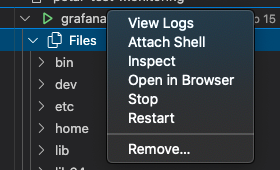

# Requirements
- Install VSCode
- Install extensions:
  - Docker
  - Remote - SSH
    


# Exercise

## Connect to container graphically

### Forward port
```
ssh -NL 3000:localhost:3000 <user>@<ip>
```

### Open browser on [localhost:3000](http://localhost:3000/)

## Connect to container in terminal

  
(it will automatically fetch all hosts from default `~/.ssh/config`)

- once you are connected to host click on docker icon:  


  
- review containers:  


  
- even open in browser without any explicit port forward command:  

